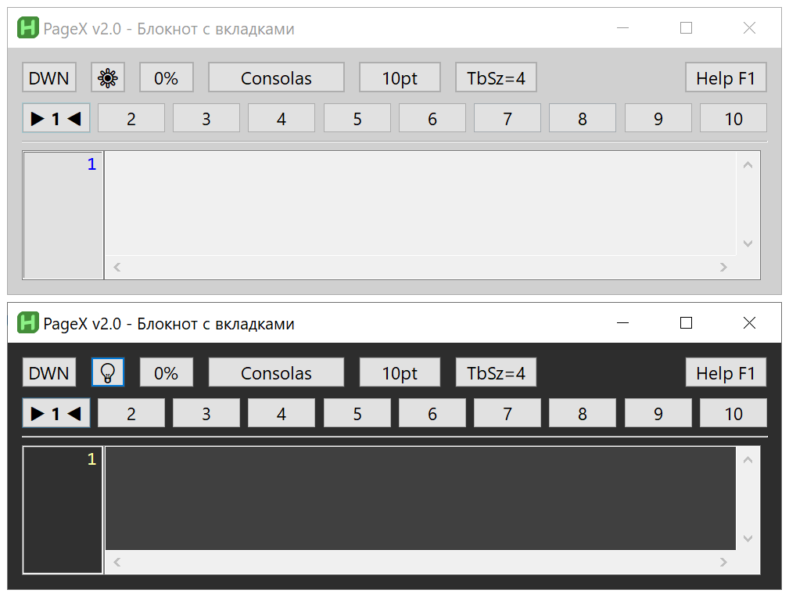
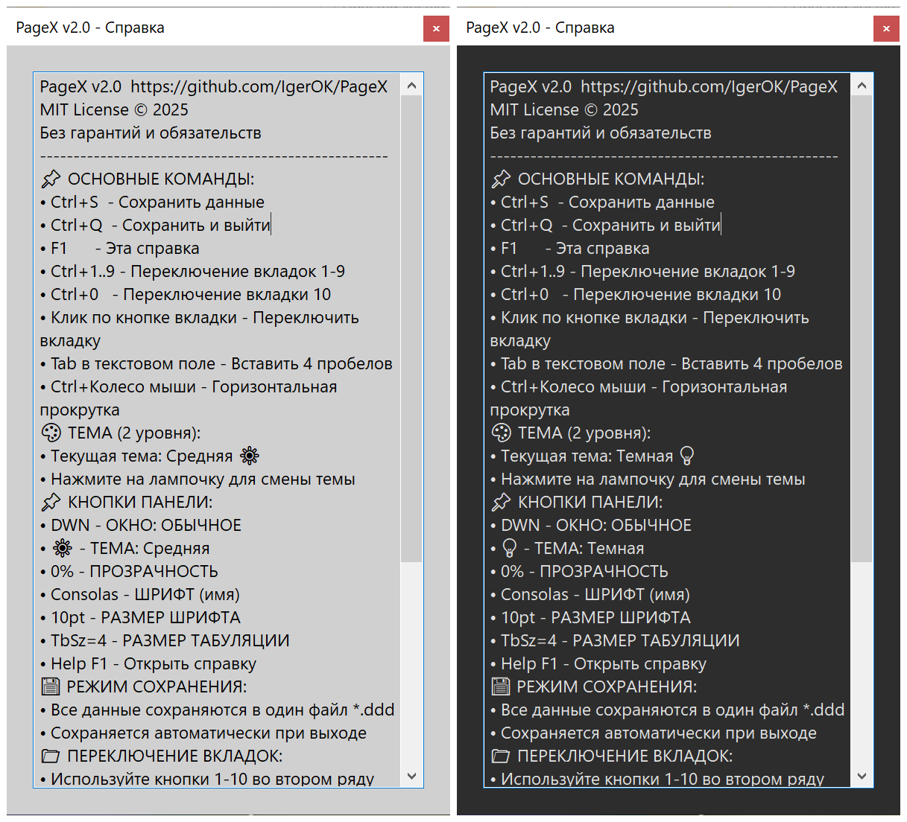

# PageX v2.0 🔄  
**Блокнот с 10 вкладками, номерами строк, простым и удобным интерфейсом**  

[](https://www.autohotkey.com/)  
[](https://opensource.org/licenses/MIT)  
[](https://github.com/IgerOK/PageX)  
[](https://www.microsoft.com/windows)  
[](https://github.com/IgerOK/PageX)  

> ⚠️ **Эта версия НЕ использует шифрование** и предназначена **только для не конфиденциальных заметок**, произвольного текста, кода и технических записей.  


---

## 🎯 Ключевые возможности

- **10 независимых вкладок** с сохранением позиции курсора  
- **Номера строк** с синхронизированной прокруткой  
- **Единый файл данных** (формат `.ddd`)  
- **2 темы оформления**: Средняя и Темная  
- **Панель быстрых настроек** с 6 параметрами: прозрачность, шрифт, размер, табуляция и др.  
- **Полная переносимость** — копируйте один `.ddd` файл на другой ПК и работайте дальше  

---

## 🔄 Что нового в v2.0?

ПАНЕЛЬ НАСТРОЕК: [UP] [🔆] [25%] [Consolas] [12pt] [TbSz=4] [Help F1]\
ПАНЕЛЬ ВКЛАДОК: [ 1 ][ 2 ][▶ 3 ◀][ 4 ][ 5 ][ 6 ][ 7 ][ 8 ][ 9 ][ 10 ]\
РАБОЧАЯ ОБЛАСТЬ: Номера строк + редактируемое поле

## 🖼️ Визуальное представление интерфейса

### Панель настроек и вкладок с разными темами:

*Рис. 1: Панель настроек (6 кнопок) и панель вкладок 1-10*

### Окно помощи с разными темами:

*Рис. 2: Окно помощи*


## 🔧 Основные улучшения:
- Полностью переработанный интерфейс с двумя панелями управления  
- Номера строк слева, синхронизированные с прокруткой текста  
- Сохранение размера окна и позиции курсора для каждой вкладки  
- Регулируемая табуляция (2/4/8 пробелов)  
- Горизонтальная прокрутка текста с `Ctrl + колесо мыши`  
- Единый файл `.ddd` вместо множества отдельных файлов  

---

## 📦 Установка

### Для обычных пользователей (рекомендуется):
1. Установите [AutoHotkey v2.0+](https://www.autohotkey.com/)  
2. Скачайте **PageX-v2.0.ahk** из [релизов](https://github.com/IgerOK/PageX/releases)  
3. Запустите файл — всё готово!

> При первом запуске автоматически создастся файл `PageX-v2.0.ddd` с вашими данными.

### Для разработчиков:
```bash
git clone https://github.com/IgerOK/PageX.git
cd PageX
# Запустите PageX-v2.0.ahk через AutoHotkey v2.0
```

## ⌨️ Горячие клавиши

`Ctrl+1`–`Ctrl+9` - Переключение на вкладки 1–9\
`Ctrl+1` - Переключение на вкладку 10\
`Ctrl+S` - Сохранить данные вкладок\
`Ctrl+Q` или `Esc` - Сохранить и выйти\
`F1` - Показать/Скрыть справку\
`Ctrl + колесо` - Горизонтальная прокрутка\
`Tab` - Вставить табуляцию (2/4/8 пробелов)\

---

## 📖 Документация
* [Журнал изменений (CHANGELOG.md)](CHANGELOG.md)
* [Лицензия (LICENSE)](LICENSE)

---

## 🎨 Оформление и настройки
**Доступные темы:**
- Средняя (🔆) — серый фон, чёрный текст
- Темная (💡) — тёмно-серый фон, светлый текст

**Поддерживаемые шрифты** (моноширинные):\
- **Consolas** (по умолчанию)
- **Cascadia Code**
- **JetBrains Mono**
- **Fira Code**
- **Courier New**

Хотите другой шрифт? Отредактируйте строку в скрипте:\
`global Fonts := ["Consolas", "Cascadia Code", ...]`

---

## 💾 Формат файла данных (.ddd)
Все данные — настройки, текст, размеры окна — хранятся в одном файле с расширением `.ddd`.\
Формат структурирован и читаем вручную:

[SETTINGS]\
AlwaysOnTop=0\
TransparencyLevel=0\
FontSize=10\
...\
---SECTION---\
[CURSOR_POSITIONS]\
Tab0=123\
Tab1=45\
...\
---SECTION---\
[TAB_DATA]\
Текст вкладки 1\
<TAB-1<\
Текст вкладки 2\
<TAB-2<\
...

---

## ⚠️ Важно знать
- Нет шифрования — данные хранятся в открытом виде
- Только Windows — требует Windows 8.1 или новее (рекомендуется Windows 10/11)
- Кодировка — UTF-8 без BOM

**Не поддерживается:**
- Форматированный текст
- Поиск и замена
- Печать
- Экспорт в другие форматы

---

## 📁 Структура проекта
PageX/\
├── PageX-v2.0.ahk       # Основной скрипт\
├── PageX-v2.0.ddd       # Файл данных (создаётся автоматически)\
├── README.md            # Этот файл\
└── LICENSE              # Лицензия MIT

---

## 📜 Лицензия
Этот проект распространяется по лицензии MIT.
```text
MIT License

Copyright (c) 2025 IgerOK

Permission is hereby granted, free of charge, to any person obtaining a copy
of this software and associated documentation files (the "Software"), to deal
in the Software without restriction, including without limitation the rights
to use, copy, modify, merge, publish, distribute, sublicense, and/or sell
copies of the Software, and to permit persons to whom the Software is
furnished to do so, subject to the following conditions:

The above copyright notice and this permission notice shall be included in all
copies or substantial portions of the Software.

THE SOFTWARE IS PROVIDED "AS IS", WITHOUT WARRANTY OF ANY KIND, EXPRESS OR
IMPLIED, INCLUDING BUT NOT LIMITED TO THE WARRANTIES OF MERCHANTABILITY,
FITNESS FOR A PARTICULAR PURPOSE AND NONINFRINGEMENT. IN NO EVENT SHALL THE
AUTHORS OR COPYRIGHT HOLDERS BE LIABLE FOR ANY CLAIM, DAMAGES OR OTHER
LIABILITY, WHETHER IN AN ACTION OF CONTRACT, TORT OR OTHERWISE, ARISING FROM,
OUT OF OR IN CONNECTION WITH THE SOFTWARE OR THE USE OR OTHER DEALINGS IN THE
SOFTWARE.
```


## 👤 Автор  
[IgerOK](https://github.com/IgerOK)

---

## 📁 Исходный код  
[github.com/IgerOK/PageX](https://github.com/IgerOK/PageX)

---

## 🙏 Благодарности
Команде AutoHotkey за мощный и гибкий язык автоматизации\
Сообществу Open Source за вдохновение и поддержку
> ⭐ Если вам нравится PageX — поставьте звезду на GitHub!


